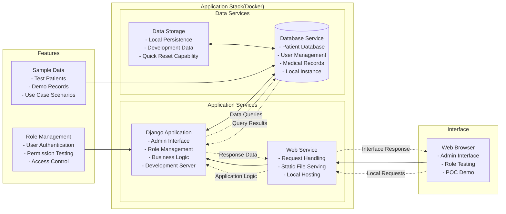
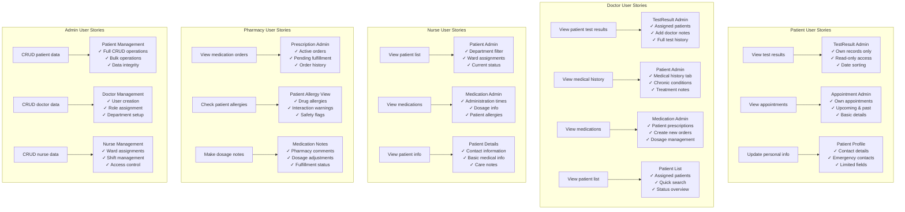

# Patient Monitoring System - Architecture Design & Decisions

## Architecture

```mermaid
graph LR
    subgraph "Application Stack(Docker)"
        subgraph "Application Services"
            DJ[Django Application<br/>- Admin Interface<br/>- Role Management<br/>- Business Logic<br/>- Development Server]
            WS[Web Service<br/>- Request Handling<br/>- Static File Serving<br/>- Local Hosting]
        end
        
        subgraph "Data Services"
            DB[(Database Service<br/>- Patient Database<br/>- User Management<br/>- Medical Records<br/>- Local Instance)]
            DS[Data Storage<br/>- Local Persistence<br/>- Development Data<br/>- Quick Reset Capability]
        end
        
    end
    
    subgraph "Interface"
        BROWSER[Web Browser<br/>- Admin Interface<br/>- Role Testing<br/>- POC Demo]
    end
    
    subgraph "Features"
        ROLES[Role Management<br/>- User Authentication<br/>- Permission Testing<br/>- Access Control]
        DATA[Sample Data<br/>- Test Patients<br/>- Demo Records<br/>- Use Case Scenarios]
    end
    
    %% Service relationships
    DJ <--> DB
    WS --> DJ
    DS <--> DB
    
    %% Developer connections
    BROWSER --> WS
    
    %% POC integration
    ROLES --> DJ
    DATA --> DB
    
    %% Local development flow
    BROWSER -.->|Local Requests| WS
    WS -.->|Application Logic| DJ
    DJ -.->|Data Queries| DB
    DB -.->|Query Results| DJ
    DJ -.->|Response Data| WS
    WS -.->|Interface Response| BROWSER
    
```

## User Story to Interface Mapping

```mermaid
graph TD
    subgraph "Patient User Stories"
        PS1[View test results] --> PAI1[TestResult Admin<br/>✓ Own records only<br/>✓ Read-only access<br/>✓ Date sorting]
        PS2[View appointments] --> PAI2[Appointment Admin<br/>✓ Own appointments<br/>✓ Upcoming & past<br/>✓ Basic details]
        PS3[Update personal info] --> PAI3[Patient Profile<br/>✓ Contact details<br/>✓ Emergency contacts<br/>✓ Limited fields]
    end
    
    subgraph "Doctor User Stories"
        DS1[View patient test results] --> DAI1[TestResult Admin<br/>✓ Assigned patients<br/>✓ Add doctor notes<br/>✓ Full test history]
        DS2[View medical history] --> DAI2[Patient Admin<br/>✓ Medical history tab<br/>✓ Chronic conditions<br/>✓ Treatment notes]
        DS3[View medications] --> DAI3[Medication Admin<br/>✓ Patient prescriptions<br/>✓ Create new orders<br/>✓ Dosage management]
        DS4[View patient list] --> DAI4[Patient List<br/>✓ Assigned patients<br/>✓ Quick search<br/>✓ Status overview]
    end
    
    subgraph "Nurse User Stories"
        NS1[View patient list] --> NAI1[Patient Admin<br/>✓ Department filter<br/>✓ Ward assignments<br/>✓ Current status]
        NS2[View medications] --> NAI2[Medication Admin<br/>✓ Administration times<br/>✓ Dosage info<br/>✓ Patient allergies]
        NS3[View patient info] --> NAI3[Patient Details<br/>✓ Contact information<br/>✓ Basic medical info<br/>✓ Care notes]
    end
    
    subgraph "Pharmacy User Stories"
        PHS1[View medication orders] --> PHAI1[Prescription Admin<br/>✓ Active orders<br/>✓ Pending fulfillment<br/>✓ Order history]
        PHS2[Check patient allergies] --> PHAI2[Patient Allergy View<br/>✓ Drug allergies<br/>✓ Interaction warnings<br/>✓ Safety flags]
        PHS3[Make dosage notes] --> PHAI3[Medication Notes<br/>✓ Pharmacy comments<br/>✓ Dosage adjustments<br/>✓ Fulfillment status]
    end
    
    subgraph "Admin User Stories"
        AS1[CRUD patient data] --> AAI1[Patient Management<br/>✓ Full CRUD operations<br/>✓ Bulk operations<br/>✓ Data integrity]
        AS2[CRUD doctor data] --> AAI2[Doctor Management<br/>✓ User creation<br/>✓ Role assignment<br/>✓ Department setup]
        AS3[CRUD nurse data] --> AAI3[Nurse Management<br/>✓ Ward assignments<br/>✓ Shift management<br/>✓ Access control]
    end
```

